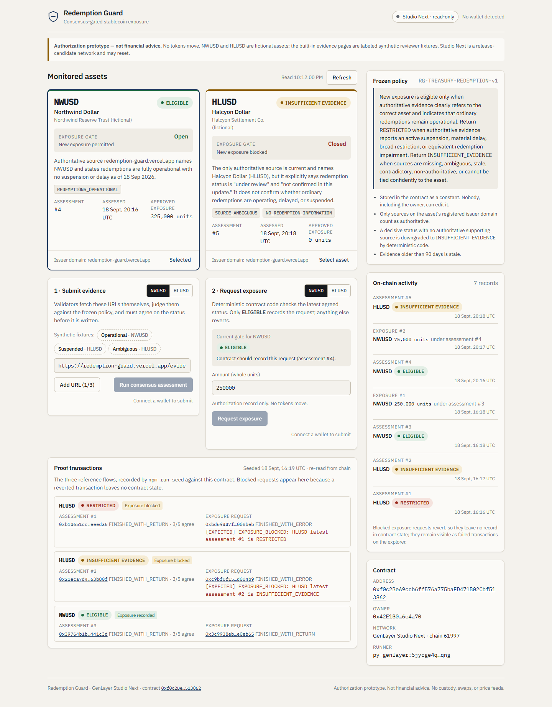

# Redemption Guard

**GenLayer validators read a stablecoin issuer's redemption evidence themselves, judge it against a frozen treasury policy, and must agree on one status. Only an agreed `ELIGIBLE` opens the exposure gate; recovery from `RESTRICTED` has a one-hour cooldown.**

- Live app: https://redemption-guard.vercel.app
- Contract (Studio Next, chain 61997): [`0x7D77A1742Ba479c1EEBE867CB1EAbCc1acF44231`](https://explorer-studio-dev.genlayer.com/address/0x7D77A1742Ba479c1EEBE867CB1EAbCc1acF44231)
- Submission write-up: [PORTAL_SUBMISSION.md](PORTAL_SUBMISSION.md) · Design: [ARCHITECTURE.md](ARCHITECTURE.md)

> Authorization prototype. Not financial advice. No tokens, custody, swaps, price feeds, database, accounts, or backend. NWUSD and HLUSD are fictional assets, and the three evidence pages are labeled synthetic reviewer fixtures.



## What it does

Every assessment returns exactly one status under this frozen policy (stored as a contract constant):

> New exposure is eligible only when authoritative evidence clearly refers to the correct asset and indicates that ordinary redemptions remain operational. Return RESTRICTED when authoritative evidence reports an active suspension, material delay, broad restriction, or equivalent redemption impairment. Return INSUFFICIENT_EVIDENCE when sources are missing, ambiguous, stale, contradictory, non-authoritative, or cannot be tied confidently to the asset.

| Status | `request_exposure` |
|---|---|
| `ELIGIBLE` | Recorded on-chain when the gate is open; a recovery from `RESTRICTED` waits one hour |
| `RESTRICTED` | Reverts `[EXPECTED] EXPOSURE_BLOCKED…` |
| `INSUFFICIENT_EVIDENCE` | Reverts |
| no assessment | Reverts |

## Repository

```
contracts/redemption_guard.py     the intelligent contract (GenVM v0.3 runner, pinned)
tests/direct/                     26 direct-mode tests (web + LLM mocked, validator logic exercised)
scripts/deploy.ts                 deploy + register the two assets + verify state
scripts/seed-demo.ts              the three proof flows, read back from chain
scripts/smoke-studio.ts           full-consensus smoke test on Studio Next
scripts/e2e-ui.ts                 browser E2E through the real UI + Transaction Kit
scripts/verify-proof.ts           re-read proof transactions (lifecycle, votes, revert reason)
frontend/                         Next.js 16 dashboard (TypeScript)
frontend/public/evidence/         the three synthetic evidence fixtures
deployments/                      studio-next.json, demo-proof.json (generated, committed)
docs/screenshots/                 desktop, tablet, mobile, and E2E screenshots
```

## Pinned toolchain (one release-candidate family)

| Piece | Version |
|---|---|
| GenVM runner (contract line 1) | `py-genlayer:5jycge4q8k23462jtb0b9fyey1s9qz928sz2nbrd9mg4sxqg2qng` (the v0.3 runner used across Studio Next; see [available runners](https://sdk.genlayer.com/main/executors/v0.3/python-sdk/available-runners.html)) |
| GenVM bundle for direct tests | `v0.6.0-rc5` (the bundle Studio `v0.123.0-rc.7` ships) |
| GenLayer CLI | `genlayer@0.40.0-rc.3` (has the built-in `studio-dev` network) |
| GenLayerJS | `genlayer-js@2.0.0-rc.1` (`studioDevnet`, chain 61997) |
| Transaction Kit | `@genlayer/transaction-kit@0.1.0-rc.2`, `@genlayer/transaction-kit-react@0.1.0-rc.2` (pinned to genlayer-js 2.0.0-rc.1) |
| Python tooling | `genlayer-test==0.30.0rc2`, `genvm-linter==0.11.1rc2`, `genlayer-py==0.19.0rc2` |
| Frontend | Next.js 16.3.5, React 19.3.0, TypeScript 5.9.3 |

All npm versions are exact (`.npmrc save-exact`), and `package-lock.json` is committed. Python pins are in `requirements.txt`.

## Setup

```bash
npm ci
```

```bash
npm run setup:python
```

`npm run setup:python` creates or repairs `.venv`, ensures it has pip, verifies
Python 3.12+, and installs the exact pins from `requirements.txt` (including
`genlayer-test[sim]==0.30.0rc2`, `genlayer-py==0.19.0rc2`, and
`genvm-linter==0.11.1rc2`). It uses `uv` when available and otherwise falls
back to the platform Python 3.12 launcher. The repository's npm Python
commands always invoke this venv directly, so a globally installed
`genlayer-test` cannot be selected accidentally.

## Verify

```bash
npm run check
```

```bash
npm run verify:proof
```

`npm run check` runs contract lint, all direct tests, frontend lint, TypeScript
checking, and the production build. `npm run verify:proof` remains separate
because it reads the live Studio Next deployment and requires network access.

```bash
npm run test:studio
```

On Windows, the Python runner sets `PYTHONIOENCODING=utf-8` for the linter,
which prints a Unicode check mark. `tests/direct/conftest.py` pins the
`v0.6.0-rc5` GenVM bundle and has two small documented shims for known
`genlayer-test 0.30.0rc2` defects: Windows temp-file deletion, and mocked LLM
JSON handed to the v0.3 std lib as an object rather than as text.

## Fee profile

`frontend/fee-profile.json` is a checked-in representative profile for Studio
Next chain 61997. It is generated from finalized fee-accounting receipts for
the committed deploy, asset-registration, assessment, and exposure proof
flows:

```bash
npm run profile:fees
```

The frontend passes this profile to Transaction Kit, which uses its measured
allocations as suggestions while still reading current fee prices and caps
from Studio Next at signing time. The deploy, seed, and smoke scripts retain
their simulation-backed `estimateTransactionFeesForWrite` path and fall back
to the live network policy when a simulation (for example, an expected revert)
cannot produce a quote. Regenerate the profile whenever the contract, GenVM,
Studio, or fee policy changes.

## Deploy and seed (Studio Next may reset)

One command redeploys the contract, registers both assets, runs all three proof flows, and writes the generated files the frontend reads:

```bash
npm run deploy:demo
```

It needs no key. On first run it creates a Studio-Next-only deployer key in the gitignored `.env`, never prints it, and funds it through Studio Next's `sim_fundAccount` faucet RPC. Afterwards, rebuild and redeploy the frontend so it picks up the new `frontend/lib/deployment.generated.json`:

```bash
cd frontend && vercel deploy --prod
```

The evidence fixtures must be reachable over public HTTPS before deploying. The scripts check this and stop if they are not. Their host (`FIXTURE_BASE_URL`, default `https://redemption-guard.vercel.app`) is registered on-chain as the demo assets' issuer domain.

## Redemption Guard v2 (additive, opt-in)

v2 is a separate contract and artifact set. It does not replace the deployed v1
address, rewrite `deployments/studio-next.json`, or modify `demo-proof.json`.
Deploy and seed it only when a fresh v2 address is acceptable:

```bash
npm run contract:lint:v2
npm run deploy:v2
npm run seed:v2
```

The v2 helpers write `deployments/studio-next-v2.json`,
`deployments/demo-proof-v2.json`, `frontend/lib/deployment.v2.generated.json`,
and `frontend/lib/proof.v2.generated.json`. No v2 deployment is committed by
default; hashes are reported only from finalized transaction receipts.

After a v2 deployment has been independently verified, an opt-in frontend build
can use `NEXT_PUBLIC_V2_CONTRACT_ADDRESS=<address>` and
`NEXT_PUBLIC_DEPLOYMENT_VERSION=v2`. The default build remains v1 so the
published proof board cannot silently switch contracts. In v2 mode, exposure
requests bind the beneficiary to the connected wallet and include a fresh
nonce and one-hour authorization expiry.

v2 adds explicit `ADMIN`, `ASSESSOR`, and `PAUSER` roles; two-step ownership
transfer; canonical per-asset source policies with required sources, minimum
usable-source counts, and monotonic policy versions; assessment validity/expiry; emergency pause;
per-asset and per-beneficiary exposure caps; caller-bound beneficiary,
nonce/expiry replay guards; and policy-version invalidation. Recovery from
`RESTRICTED` retains the one-hour cooldown. These are authorization and
idempotency controls, not token settlement: the installed SDK has no verified
token adapter, signature authorization, atomic transfer, or multisig primitive
used here. A real asset adapter must re-check beneficiary authorization and
perform the token movement atomically outside this prototype.

## Studio Next notes

- RPC `https://studio-dev.genlayer.com/api`, chain 61997, explorer `https://explorer-studio-dev.genlayer.com`.
- Writes need explicit fees. The scripts use `estimateTransactionFeesForWrite` (simulation) and fall back to `estimateTransactionFees`. The UI uses Transaction Kit's fee review.
- The RPC allows about 30 requests per minute per client. The dashboard makes one aggregated read (`get_dashboard`) every 30 s, pauses polling while a transaction is tracked, and spaces and retries its RPC calls. The scripts back off on rate limits.
- `gen_dbg_traceTransaction` is not served, so revert reasons are decoded from `consensus_data.leader_receipt[0].result` (a result-code byte followed by the payload).

## Recovery cooldown

An assessment that moves an asset from `RESTRICTED` to `ELIGIBLE` is recorded immediately, but the deterministic exposure gate remains closed for one hour from that assessment's transaction timestamp. The assessment exposes the exact `gate_open_at` time, and `request_exposure` reverts with an `[EXPECTED] EXPOSURE_BLOCKED` reason until that time. This prevents a single favorable re-assessment from reopening exposure instantly after a suspension.
